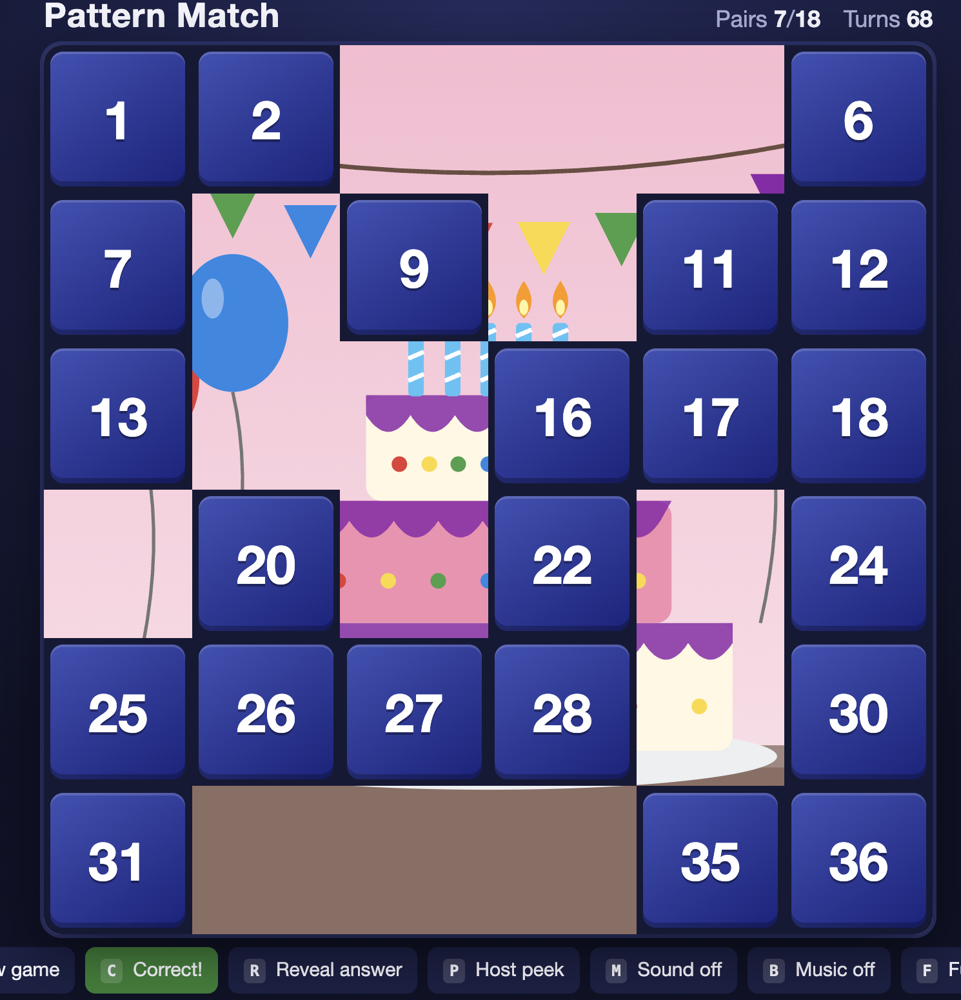
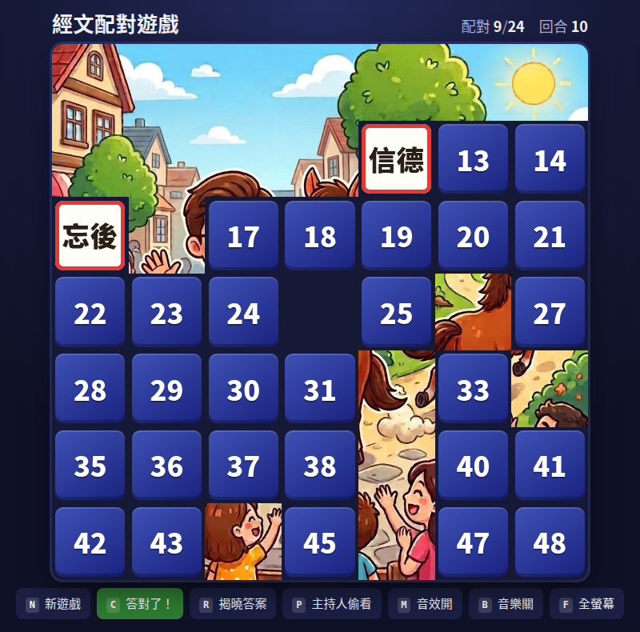

# Pattern Match

A host-run memory game for a big screen. Numbered tiles hide pairs — pictures in the
Classic and Bible editions, Chinese Bible phrases in Scripture Pairs.
Every matched pair disappears and uncovers part of a hidden answer image under the board.
The audience shouts out what they think the picture is, and the host decides if they're right.

**Play online:** <https://leungadh.github.io/Pattern-matching-game/> — or download the
folder and double-click `index.html`; it works offline too.

<p align="center">
  
</p>

## Three editions

| Edition | Folder | Contents |
|---|---|---|
| **Classic** | `classic/` | 6×6 board, 18 icon pairs, 12 answer pictures (lighthouse, castle, volcano…) |
| **Bible** | `bible/` | 6×6 board, 18 Bible-symbol pairs, 10 story pictures (Noah's Ark, the Red Sea, Daniel…) |
| **Scripture Pairs 經文配對** | `scripture/` | 7×7 board: 48 tiles of Bible phrases in 24 pairs, empty centre cell, Chinese UI, one answer picture |

All run on the same engine in `engine/`, so a fix made once applies to every edition.

### Scripture Pairs 經文配對

The two halves of a pair are different words that belong together — 真理 matches
束腰帶子, 標竿 matches 直跑 — so the room has to know the verse. The phrases come from
Ephesians, Philippians and Colossians.

<p align="center">
  
</p>

- 48 tiles are numbered 1–48 around the empty centre cell.
- Cards stay up longer than in the picture editions (2.2 s on a miss, 1.5 s on a match), so the room can read them.
- When the host presses **C** or **R**, the board clears to the picture alone — no answer text on screen (`revealText: false` in `scripture/config.js`).
- All on-screen text is in Traditional Chinese, using system fonts (PingFang on Mac, Microsoft JhengHei on Windows).

## Run it (Windows or Mac)

1. Copy the whole `Pattern-matching-game` folder to the PC (USB stick, OneDrive, zip file — any way works).
2. Double-click `index.html` at the top level and pick an edition — or go straight to `classic/index.html`, `bible/index.html` or `scripture/index.html`.
   It opens in Edge or Chrome. You don't need to install anything, and it works offline.
3. Press **F** for full screen.

## How to play

- The audience calls out two tile numbers. The host clicks them or types them (for example `1` `2` for tile 12; for tiles 1–3, press Enter).
- **Match:** the pair glows gold, then fades away and shows that part of the answer image.
- **No match:** the tiles flash red and flip back.
- Anyone can guess the picture at any time. The host presses **C** if the guess is right and **R** to show the answer if nobody gets it.

## Host keys

| Key | Action |
|---|---|
| `1`–`36` (`1`–`48` in Scripture Pairs) | Flip that tile |
| **C** ×2 | Correct! Shows the whole picture with confetti |
| **R** ×2 | Shows the whole picture (nobody guessed it) |
| **N** | New game (press twice if a round is in progress) |
| **P** | Host peek. Shows the answer title for 3 seconds. The audience can see it too, so look away from the projector or blank it first. |
| **M** | Sound effects on/off |
| **B** | Background music on/off (speeds up as more of the picture appears) |
| **F** | Full screen |
| Esc | Cancels a half-typed tile number |

C, R and N (during a round) need a second press within 2.5 seconds, so a stray key press can't spoil a round.

## Sounds

All sounds are made by the browser, so there are no audio files to copy.

- **Flip:** a card swish.
- **Match:** a chime that climbs higher with every match in a row. Three or more in a row adds a sparkle.
- **Miss:** a gentle "uh-oh". It also resets the streak.
- **Milestones:** a jingle when half the pairs are found, and a flourish when the board is cleared.
- **Pressing C or R once:** a drum roll while you confirm. Then a fanfare with a cymbal crash for a correct guess, or a "wah-wah-wahhh" if nobody got it.
- **New game:** a card-shuffle sound.

The volume and the on/off defaults are in each edition's `config.js` (`sound`, `music`, `volume`).

## Add your own pictures

Each edition is self-contained: `<edition>/config.js`, `<edition>/icons/`, `<edition>/answers/`.
Edit the edition you want to change; the others are untouched.

**New answer image:** put a square JPG, PNG or SVG in `bible/answers/`, then add one line to `ANSWERS` in `bible/config.js`:

```js
const ANSWERS = [
  { image: "answers/noahs-ark.svg",  title: "Noah's Ark" },
  { image: "answers/my-photo.jpg",   title: "The Good Samaritan" }   // ← new
];
```

**New tile icons:** put them in `<edition>/icons/` and add their paths to `ICONS`.
If there are more than 18, each game picks 18 at random.

**Board size:** set `gridSize` (4 = 16 tiles, 6 = 36 tiles, 8 = 64 tiles). You need at least (gridSize²)/2 icons.
An odd size (5, 7) leaves the centre cell empty, so 7 = 48 tiles = 24 pairs.

**Text pairs instead of pictures:** list them as `pairs` in `config.js` (see `scripture/config.js`).
The easiest way is to keep them in a spreadsheet saved as *CSV UTF-8* with the columns
`number, left text, right text`, then run:

```
python3 tools/csv_to_pairs.py scripture/pairs.csv scripture/config.js
```

**On-screen text:** every message the game writes (banners, "Press again to confirm"…) can be
translated under `strings` in `config.js` — see `scripture/config.js` for the Chinese set.

**Answer banner:** set `revealText: false` in `config.js` to end the round on the picture alone,
without the "Correct! It's …" / "It was: …" banner. Host peek (P) still shows the title.

**Chinese titles:** put the Chinese text in the `title` field, never in the file name.
File names must stay lowercase ASCII — Chinese file names break on Windows and in URLs.

## Files

```
index.html            landing page — pick an edition
.nojekyll             tells GitHub Pages to serve the files as-is

engine/               shared by all editions
  style.css           look and animations
  game.js             game rules (plain JavaScript, no libraries)
  sound.js            sound effects and background music (generated, no audio files)

classic/              Classic edition
  index.html
  config.js           ← the only file you normally edit
  icons/              18 tile pictures (SVG)
  answers/            12 hidden answer pictures

bible/                Bible edition — same shape
  index.html
  config.js
  icons/
  answers/

scripture/            Scripture Pairs edition — text tiles, no icons
  index.html
  config.js           PAIRS (generated from pairs.csv), answers, Chinese strings
  pairs.csv           the 24 phrase pairs — edit this, then run tools/csv_to_pairs.py
  answers/            doctor-and-horse.jpg (the answer), plus the Bible story pictures (unused)

assets/hero.png       screenshots used by this README
assets/scripture.png
tools/csv_to_pairs.py       copies pairs.csv into config.js        (needs Python)
tools/make_icons.py         re-generates classic/icons/        (optional, needs Python)
tools/make_answers.py       re-generates classic/answers/      (optional, needs Python)
tools/make_bible_icons.py   re-generates bible/icons/          (optional, needs Python)
tools/make_bible.py         re-generates bible/answers/        (optional, needs Python)
tools/smoke.js              browser test of all three editions (needs Node + Playwright)
```

File names are case-sensitive on the web, so `Lighthouse.JPG` and `lighthouse.jpg` are different files. Keep names lowercase with no spaces to be safe.
